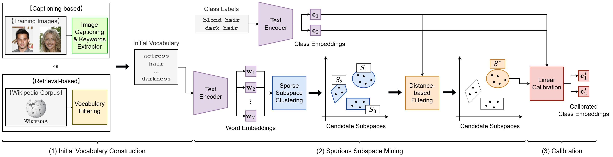

# Linear Calibration Approach to Knowledge-free Group Robust Classification
We provide Pytorch implementation of the BMVC 2024 paper "Linear Calibration Approach to Knowledge-free Group Robust Classification".

## Abstract
<p align="center">

</p>

Large-scale pre-trained vision-language models such as CLIP have shown remarkable performance on various downstream tasks. However, such a model often learns
not only the information that is truly useful for classification, but also group attributes
that are spuriously correlated with classes, leading to misclassification of an image into
a group with the same group attributes but with the wrong class. The goal of this paper is to develop a method for learning a classifier that is robust to the group attributes.
Unlike existing methods, our method is (i) knowledge-free: does not use any information of group attributes for training, (ii) linear: a lightweight method that trains only a
single linear projection, and (iii) calibration-based: does not change the original classifier at all. The negative effects of the group attributes can be canceled by projecting the classification space to the orthogonal complement of the subspace spanned by
the group attributes. To achieve this, we propose Spurious Subspace Mining (SSM)
to discover the subspace from a random set of text embeddings without any supervision. Experimental results on two standard benchmark datasets, Waterbirds and CelebA,
show that the proposed method outperforms various existing methods and improves zeroshot baseline by 35.2% in worst-group accuracy. Our code is available at https://github.com/LyricProduct/SSM.git

## Setup

### 1. Environment
Please follow the steps below to build your environment.

```bash
# Create a conda environment 
conda create -n ssm python=3.11
conda activate ssm

# Install torch and torchvision
# We recommend PyTorch 2.1.2
# Please refer to https://pytorch.org/ if you need a different cuda version
conda install pytorch==2.1.2 torchvision==0.16.2 torchaudio==2.1.2 pytorch-cuda=11.8 -c pytorch -c nvidia

# Clone this repo
git clone https://github.com/LyricProduct/SSM.git
cd SSM

# Install dependencies
pip install -r requirements.txt

# Finished
```

### 2. Data Preparation
#### Waterbirds and CelebA
See [this work](https://github.com/chingyaoc/debias_vl).

### 3. Run
To reproduce the results of the paper, please execute the following code.
``` python
# Waterbirds, Captioning-based
python main.py --dataset waterbirds --load_base_model clip_ViTL14 --dist_method Distance-based --base Captioning-based --V 40 --K 2 --debias

# Waterbirds, Retrieval-based
python main.py --dataset waterbirds --load_base_model clip_ViTL14 --dist_method Distance-based --base Retrieval-based --V 60 --K 3 --debias

# CelebA, Captioning-based
python main.py --dataset celebA --load_base_model clip_ViTL14 --dist_method Distance-based --base Captioning-based --V 200 --K 7 --debias

# CelebA, Retrieval-based
python main.py --dataset celebA --load_base_model clip_ViTL14 --dist_method Distance-based --base Retrieval-based --V 130 --K 5 --debias
```
